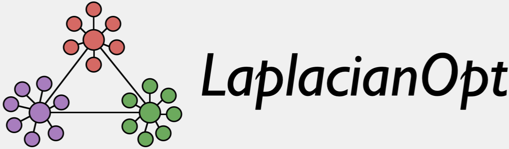
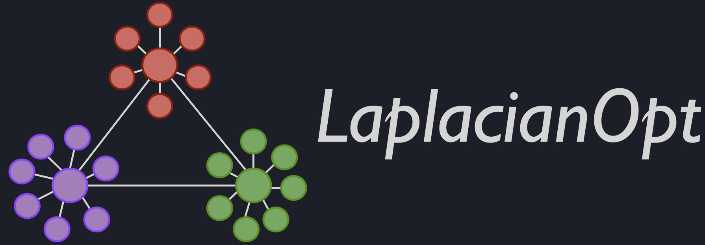

<!-- ```@raw html
<align="center"/>


``` -->

# LaplacianOpt Documentation

```@meta
CurrentModule = LaplacianOpt
```
## Overview
**[LaplacianOpt](https://github.com/harshangrjn/LaplacianOpt.jl)** is a Julia package which implements polyhedral relaxation-based algorithms for the maximimum algebraic connectivity augmentation problem on weighted graph Laplacians. More specifically, given a weighted base graph with existing edges (could be empty), a set of candidate weighted edges for augmentation, and an augmentation budget (`K`), this package finds a set of `K` edges to augment to the base graph such that the resulting graph has maximum algebraic conenctivity with optimality guarantees.  For example, given a base graph with `N` vertices and `0` edges, set of candidate edges which form a complete graph, and `K = (N-1)`, this packages finds a spanning tree with maximum algebraic connectivity.

[Algebraic connectivity](https://dml.cz/bitstream/handle/10338.dmlcz/101168/CzechMathJ_23-1973-2_11.pdf) is the second smallest eigenvalue of the graph Laplacian. The magnitude of this value reflects how well connected the overall graph is. This connectivity measure has been used in analyzing the robustness and synchronizability of complex networks, and in graph sparsification techniques. 

## Installation 
To use LaplacianOpt, first [download and install](https://julialang.org/downloads/) Julia. Note that the current version of LaplacianOpt is compatible with Julia 1.0 and later. 

The latest stable release of LaplacianOpt can be installed using the Julia package manager with

```julia
import Pkg
Pkg.add("LaplacianOpt")
```

At least one mixed-integer programming solver is required for running LaplacianOpt. The well-known [CPLEX](https://github.com/jump-dev/CPLEX.jl) or the [Gurobi](https://github.com/jump-dev/Gurobi.jl) solver is highly recommended, as it is fast, scaleable and can be used to solve on fairly large-scale graphs. However, the open-source [GLPK](https://github.com/jump-dev/GLPK.jl) solver is also compatible with LaplacianOpt which can be installed via the package manager with

```julia
import Pkg
Pkg.add("GLPK")
```

## Unit Tests
To run the tests in the package, run the following command after installing the LaplacianOpt package.

```julia
import Pkg
Pkg.test("LaplacianOpt")
```

## Citing LaplacianOpt
If you find LaplacianOpt.jl useful in your work, we request you to cite the following papers [\[link-1\]](https://doi.org/10.1109/ECC.2015.7330770) [\[link-2\]](https://doi.org/10.1115/1.4028955): 
```bibtex
@inproceedings{LOpt_ECC2015,
  title={On maximizing algebraic connectivity of networks for various engineering applications},
  author={Nagarajan, Harsha and Rathinam, Sivakumar and Darbha, Swaroop},
  booktitle={European Control Conference (ECC)},
  pages={1626--1632},
  year={2015},
  organization={IEEE}
}

@article{LOpt_ASME2015,
  title={Synthesizing robust communication networks for unmanned aerial vehicles with resource constraints},
  author={Nagarajan, Harsha and Rathinam, Sivakumar and Darbha, Swaroop},
  journal={Journal of Dynamic Systems, Measurement, and Control},
  volume={137},
  number={6},
  pages={061001},
  year={2015},
  publisher={American Society of Mechanical Engineers}
}
```