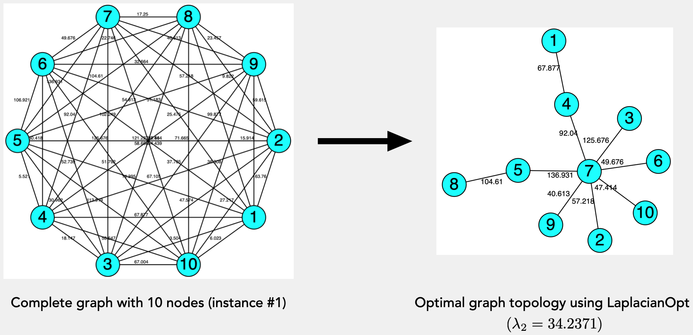

# Quick Start Guide

## Getting started

After the installation of LaplacianOpt and CPLEX (use GLPK if open-source is preferable) from the Julia package manager, and the cost matrix of the complete graph (for example, see [`examples/instances/5_nodes`](https://github.com/harshangrjn/LaplacianOpt.jl/tree/main/examples/instances/5_nodes)) is provided in the JSON format, an optimization model to maximize the algebraic connectivity of the weighted graph's Laplacian matrix can be executed with a few lines of code as follows:

```julia
import LaplacianOpt as LOpt
using JuMP
using Gurobi

params = Dict{String, Any}(
"num_nodes" => 5,
"instance" => 1
)

lopt_optimizer = JuMP.optimizer_with_attributes(Gurobi.Optimizer, "presolve" => 1) 
results = LOpt.run_LOpt(params, lopt_optimizer)
```

!!! tip
    Run times of [LaplacianOpt](https://github.com/harshangrjn/LaplacianOpt.jl)'s mathematical optimization models are significantly faster using [Gurobi](https://www.gurobi.com) as the underlying mixed-integer programming (MIP) solver. Note that this solver's individual-usage license is available [free](https://www.gurobi.com/academia/academic-program-and-licenses/) for academic purposes. 

# Extracting results
The run commands (for example, `run_LOpt`) in LaplacianOpt return detailed results in the form of a dictionary. This dictionary can be used for further processing of the results. For example, for the given instance of a complete graph, the algorithm's runtime and the optimal objective value (maximum algebraic connectivity) can be accessed with,

```julia
results["solve_time"]
results["objective"]
```

The `"solution"` field contains detailed information about the solution produced by the optimization model.
For example, one can obtain the edges of the optimal graph toplogy from the symmetric adjacency matrix with,

```Julia
optimal_graph = LOpt.optimal_graph_edges(results["solution"]["z_var"])
```
Further, algebraic connectivity and the Fiedler vector of the optimal graph topology (though can be applied on any graph topology) can be obtained from the adjacency matrix with,
```Julia
data = LOpt.get_data(params)
adjacency_matrix = data["adjacency_base_graph"] + data["adjacency_augment_graph"]
optimal_adjacency = results["solution"]["z_var"] .* adjacency_matrix 
graph_data = LOpt.GraphData(optimal_adjacency)
println("Algebraic connectivity: ", graph_data.ac)
println("Fiedler vector: ", graph_data.fiedler)
```

# Visualizing results
LaplacianOpt also currently supports the visualization of optimal graphs layouts obtained from the `results` dictionary (from above. To do so, these are the two options: 
+ [TikzGraphs](https://github.com/JuliaTeX/TikzGraphs.jl) package for a simple and quick visualization of the graph layout without support to include edge weights, which can be executed with 

```julia
data = LOpt.get_data(params)
LOpt.visualize_solution(results, data, visualizing_tool = "tikz")
```

+ [Graphviz](https://graphviz.org) package for better visualization of weighted graphs. To this end, LaplacianOpt generates the raw `.dot` file, which can be further visualized using the Graphviz software either via the direct [installation](https://graphviz.org/download/) on the computer or using an online front-end visualization GUI (for example, see [Edotor](https://edotor.net)). Dot files can be generated in LaplacianOpt with 

```julia
data = LOpt.get_data(params)
LOpt.visualize_solution(results, data, visualizing_tool = "graphviz")
```
For example, on a weighted complete graph with 10 nodes in [instance #1](https://github.com/harshangrjn/LaplacianOpt.jl/blob/main/examples/instances/10_nodes/10_1.json), the optimal spanning tree with maximum algebraic connectivity, out of ``10^8`` feasible solutions, obtained by LaplacianOpt (using Graphviz visualization) is shown below 



